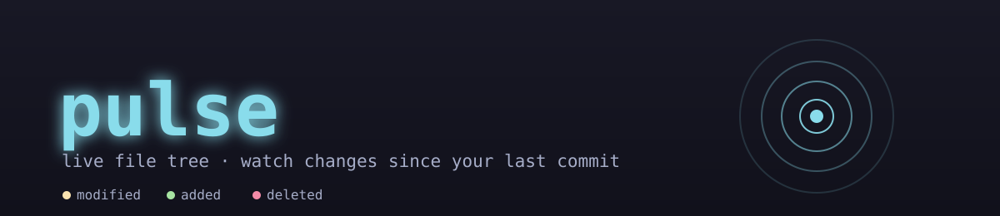

<p align="center">
  
</p>

A live file tree for watching a repo change in real time — every add, edit,
delete, and rename since your last commit, updating as it happens. Built for
watching AI coding agents (Claude Code, or anything else) work on a
codebase: point it at a directory and see exactly what's changing, live, in
a compact terminal pane.

## Install

Clone this repository, then run the installer from inside it:

```bash
./install.sh
```

This builds the tool and symlinks the `pulse` command onto your PATH (into
`~/.local/bin`), adding that directory to your shell config automatically if
it isn't on your PATH already. Re-running `install.sh` is safe — it just
rebuilds and re-links.

Requires [Node.js](https://nodejs.org) 18+.

## Usage

```bash
pulse                   # watch the current directory
pulse <dir>              # watch a specific directory
pulse -p <dir>           # same as above, as a flag
pulse --no-gitignore     # also include files matched by .gitignore
pulse --help
```

## What you'll see

- A tree that starts fully collapsed and auto-expands only down to whatever
  actually changed — untouched directories stay collapsed behind a `●N`
  badge instead of cluttering the view
- `M` / `A` / `D` status per file, color-coded, with a live sky-colored
  flash the instant a file is written, fading into its steady status color
- Time since each change (`2s`, `11m`, ...) — falls back to the file's
  on-disk mtime if it was already dirty before you launched `pulse`
- `enter` / `o` on a file opens a scrollable diff view; `esc` goes back

Everything is scoped to changes **since your last commit** — commit, and the
tree goes quiet.

## Keybindings

| Key | Action |
|---|---|
| `j` / `↓`, `k` / `↑` | move the cursor |
| `enter` / `o` | expand/collapse a directory, or open a file's diff |
| `c` | collapse the selected directory |
| `esc` | back to the tree, from a diff |
| `q` / `ctrl+c` | quit |

Inside a diff view:

| Key | Action |
|---|---|
| `j` / `k` | scroll one line |
| `d` / `u` (or PageDown/PageUp) | scroll one page |
| `esc` | back to the tree |

## Development

```bash
npm start            # run it against the current directory
npm test              # stress-test the engine against ~20 edge cases
npm run demo           # watch it live against a scripted sequence of real changes
npm run demo:clean     # remove the demo playground
```

`npm test` builds throwaway git repos under the OS temp dir and exercises
file listing, git status parsing, tree building, and diffing against long
names, huge files, binaries, symlinks, renames, unicode filenames, and more
— see `test/stress-test.mjs`. `npm run demo` is the visual counterpart: a
paced, watchable sequence of real changes to try against a running `pulse`.

## How it works

`pulse` uses `fsnotify`-style filesystem watching (via `chokidar`) purely as
a trigger — the source of truth for *what* changed is always `git status`
against `HEAD`, respecting `.gitignore` by default. Filesystem events are
debounced and batched so a burst of changes (an agent writing dozens of
files in a loop) doesn't flood the terminal with re-renders.

---

Made by [shotu](https://github.com/shotu).
